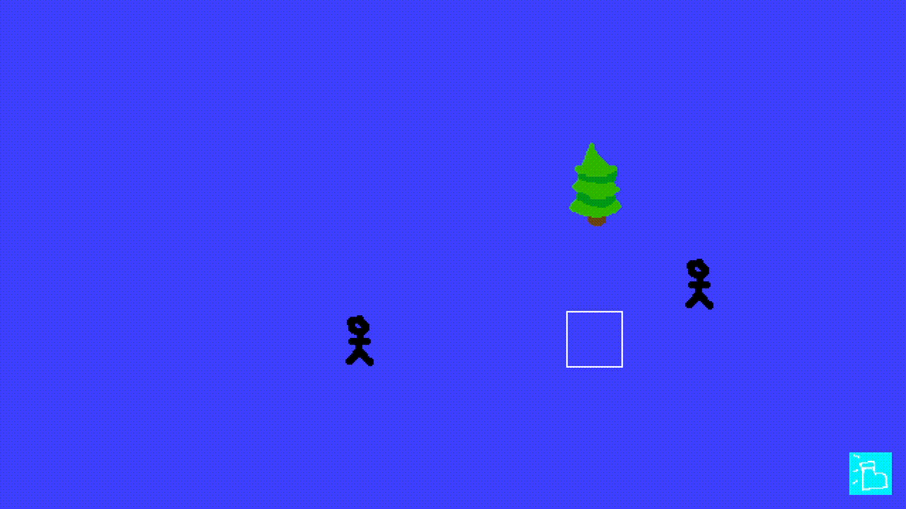

# New game

Starting a new project (again), hopefully I will actually stick to it this time. Not much to put in for the first devlog, mostly learning rust and how to properly utilize an ECS, most of the project setup is super jank right now. Currently have a basic grid system with snappy movement and a single button working, hoping to clean some of this up since it's starting to get super messy and hard coded.

